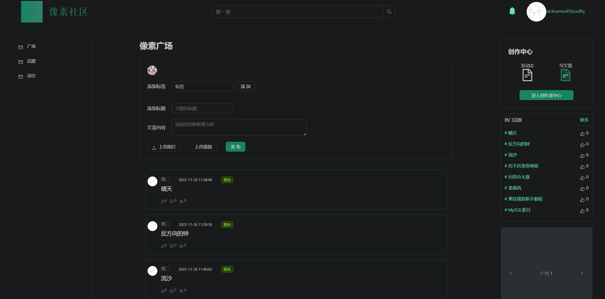
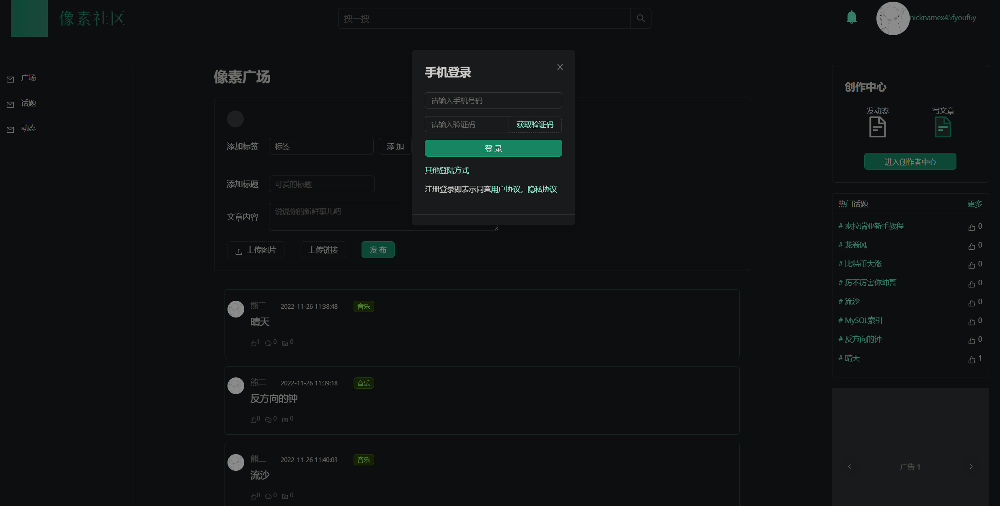
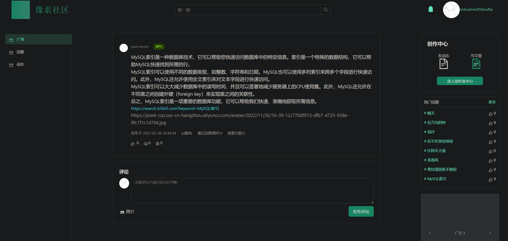
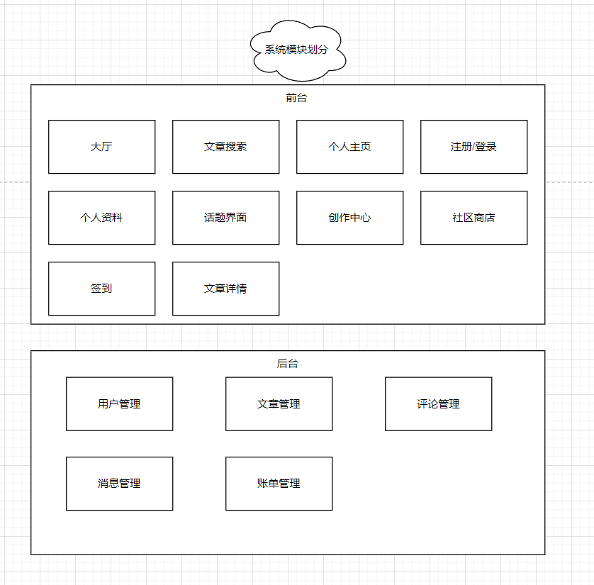
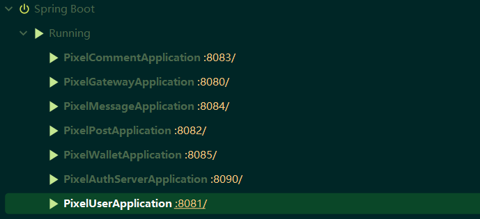

<div align=center>
    # 像素社区（pixel-ccp）
</div>

目前仍在施工中 🚧，欢迎您的加入！

后端基于 SpringCloud+Nacos+OpenFeign+MySQL+Redis+Sentinel; 前端基于：Vue3+Vite+TypeScript 等技术栈实现的微服务社区系统。


# 项目介绍
像素社区是一个支持知识付费的微服务社区。
本系统有以下界面：

- 首页大厅
- 个人主页
- 个人资料
- 话题界面
- 登录/注册界面
- 创作中心
- 社区商店
- 签到界面
- 文章详情页
- ...

## 项目演示
### 社区广场


### 项目登录


### 阅读文章


## 系统功能

- 首页大厅
    - 首页大厅需要展示文章，并且可以满足用户选择「推荐」，「最新」，「热门」的排序
    - 需要有热门文章的榜单
    - 用户可以根据关键词检索文章
    - 别的用户可以发送消息给用户，并在提醒处冒出消息数气泡
- 个人主页
    - 用户可以在个人主页查看自己发布的文章，动态
    - 用户可以在个人主页编辑个人资料
    - 用户可以查看自己关注的博主，或者和别的用户的共同关注
    - 用户可以接收到关注博主的动态推流
- 个人资料
    - 用户可以编辑个人信息，上传头像
- 话题界面
    - 展示所有的话题，并且可以满足用户选择「最新」，「热门」的排序
- 登录/注册界面
    - 注册
    - 密码+验证码登录
    - 手机号验证码登录
    - 单点登录
- 创作中心
    - 用户可以创作并发布文章，动态
- 社区商店/社区内购
    - 用户可以用像素币下单购买商品
    - 用户可以充值像素币
- 签到界面
    - 用户连续签到统计功能，签到会发放像素币
- 文章详情页
    - 用户可以阅读文章，并且点赞，收藏文章
- ...
  
# 系统设计
## 系统模块划分


## 数据库设计
> UML图


# 搭建步骤
## 本地搭建步骤
>前端启动

```bash
cd .\frontend\
npm install
npm run dev
```

> 后端启动

```bash
mvn install
```
启动本地/远程的 Redis 和 Nacos 服务
修改本项目的配置文件，使之连接上您的服务

然后启动 web 包下的几个模块的主启动类


## 环境搭建
|     工具      | 版本      | 下载                                                                                                                 |
|:-------------:|:--------|----------------------------------------------------------------------------------------------------------------------|
|      jdk      | 11      | [https://www.oracle.com/java/technologies/downloads/](https://www.oracle.com/java/technologies/downloads/) |
|     maven     | 3.8.6   | [https://maven.apache.org/](https://maven.apache.org/)                                                               |
|     mysql     | 8.0+    | [https://www.mysql.com/downloads/](https://www.mysql.com/downloads/)                                                 |
|     redis     | 5.0+    | [https://redis.io/download/](https://redis.io/download/)                                                             |
|      git      | 2.36.1  | [http://github.com/](http://github.com/)                                                                             |
|    docker     | 4.10.0+ | [https://docs.docker.com/desktop/](https://docs.docker.com/desktop/)                                                 |
