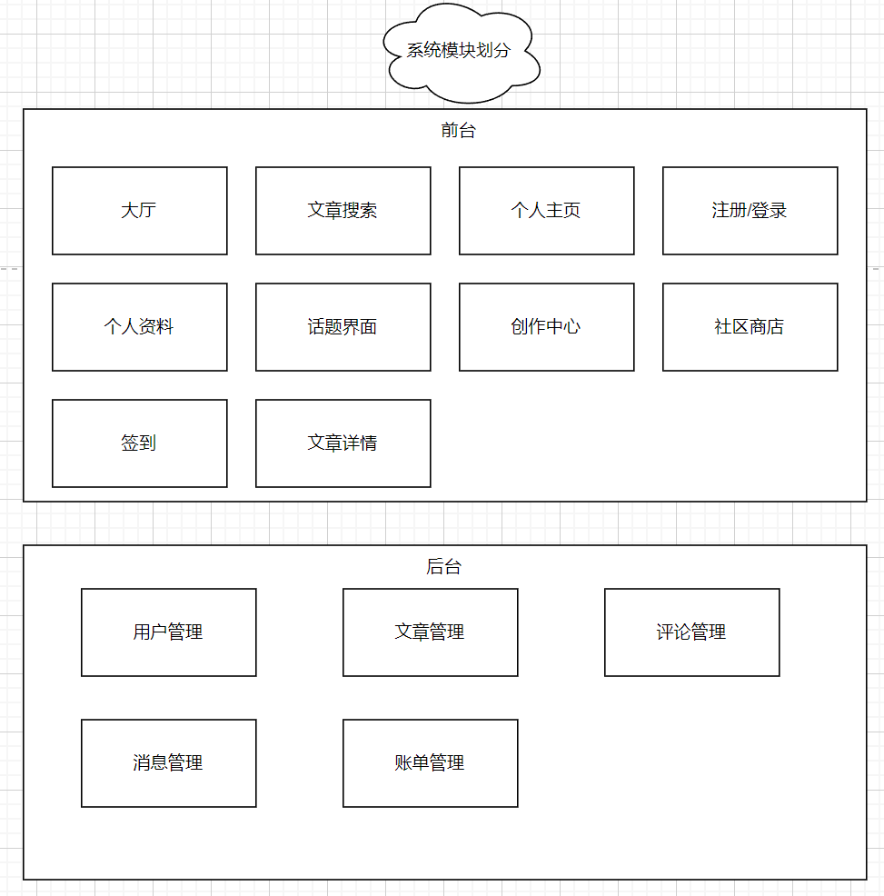
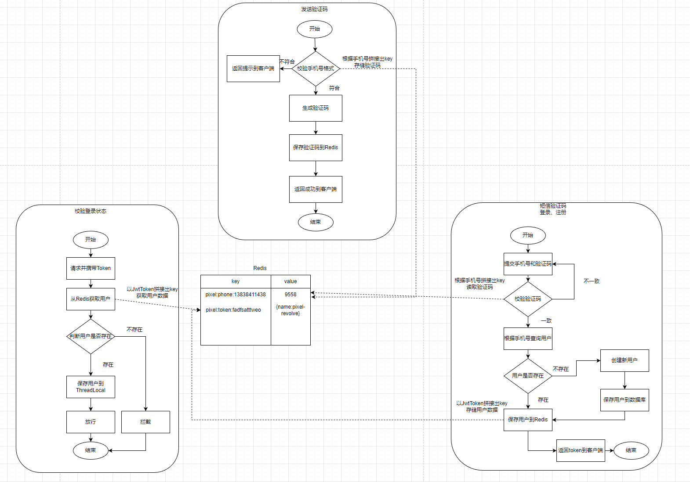
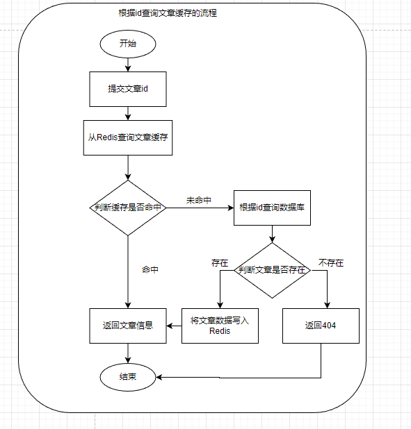
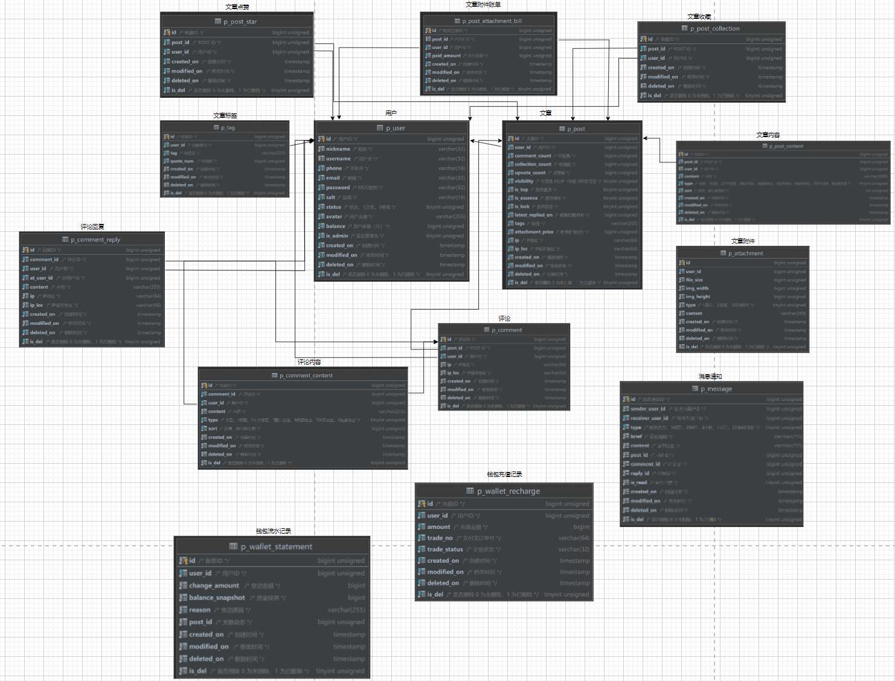

# 1.引言

## 1.1.项目背景和意义

像素社区是一个支持知识付费的微服务社区。

# 2.系统需求分析及相关技术介绍

## 2.1.功能需求分析

本系统有以下界面：

- 首页大厅
- 个人主页
- 个人资料
- 话题界面
- 登录/注册界面
- 创作中心
- 社区商店
- 签到界面
- 文章详情页

本系统有以下功能：

- 首页大厅

  - ✔首页大厅需要展示文章，并且可以满足用户选择「推荐」，「最新」，「热门」的排序

  - ✔需要有热门文章的榜单

  - 用户可以根据关键词检索文章

  - 别的用户可以发送消息给用户，并在提醒处冒出消息数气泡

- 个人主页

  - ✔用户可以在个人主页查看自己发布的文章，动态
  - ✔用户可以在个人主页编辑个人资料
  - 用户可以查看自己关注的博主
  - 用户可以查看自己和别的用户的共同关注
  - 用户可以接收到关注博主的动态推流

- 个人资料

  - ✔用户可以编辑个人信息，上传头像

- 话题界面

  - 展示所有的话题，并且可以满足用户选择「最新」，「热门」的排序

- 登录/注册界面

  - 注册
  - 密码+验证码登录
  - ✔手机号验证码登录
  - 单点登录

- 创作中心

  - ✔用户可以创作并发布文章
  - 用户可以发布动态

- 社区商店/社区内购

  - 用户可以用像素币下单购买商品

- 签到界面

  - ✔用户连续签到统计功能(签到会发放像素币)

- 文章详情页

  - ✔文章详情（用户可以阅读文章）
  - ✔点赞文章
  - ✔收藏文章
- 钱包界面
  - 查询余额
  - 用户充值

## 2.2.可行性分析

...

## 2.3.系统运行环境

运行环境：

- JDK11
- MySQL 8.0.11
- Spring Cloud 2021.0.0
- Spring Cloud Alibaba 2.2.5.RELEASE
  - SpringBoot 2.6.2		

开发工具：

- idea

## 2.4.相关技术介绍

前端：

- ...

后端：

- Spring Cloud Alibaba
  - 注册中心：Nacos
  - 配置中心：Nacos
  - 链路监控：Sentinel
- Spring Cloud
  - 远程通信：openfeign
- SpringBoot
- Mybatis-plus
- Redis
- Mybatis
- RabbitMQ
- Seata

项目管理：

- 语雀
- git

# 3.系统总体设计

## 3.1.系统功能结构

> 系统模块划分

## 3.2.系统功能流程设计

> 手机号验证码快捷登录业务设计

> 文章展示业务

> 注册业务设计

> 文章下单业务设计

> 点赞业务设计

> 收藏业务设计

## 3.3.数据库设计

### 3.3.1.概念结构设计

> 总体UML图

详情见本项目->docs->UML.drawio

> 总体ER图

### 3.3.2.逻辑结构设计

# 4.系统详细设计

## 4.1.文章模块详细设计

> 文章展示业务

- > `/api/pPost/selectOne/{id}`

  - > 测试结果：

    未命中缓存时测试接口响应耗时间23ms

    命中缓存时接口响应耗时平均5ms

    单个线程tps为220

    最优tps为6000

    可以抗住5000并发

  - > 优化

    为了节省缓存空间，为缓存设置过期值。

    为了预防缓存穿透问题，选择缓存空数据。

    

    

  

  

# 5.系统实现

